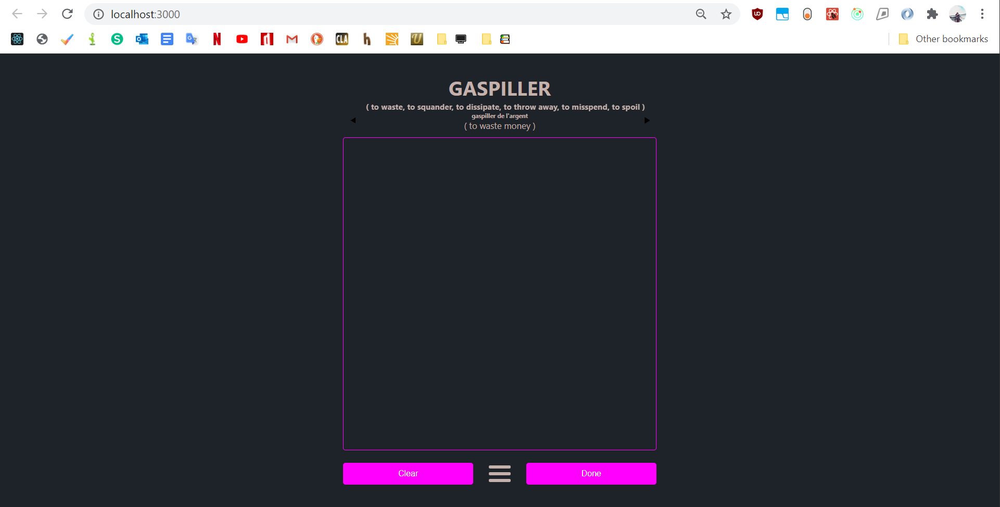
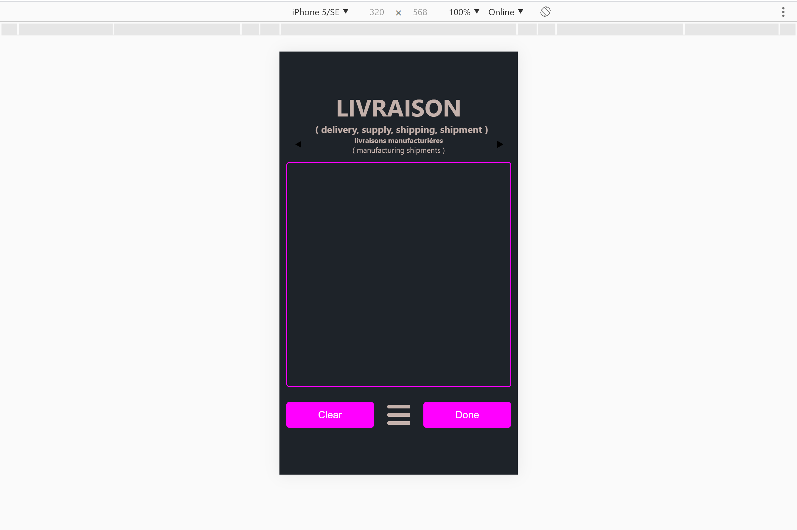
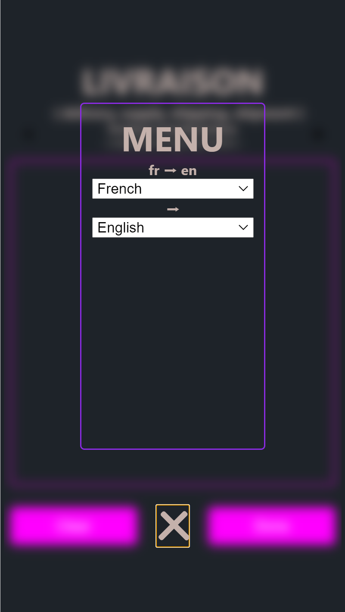
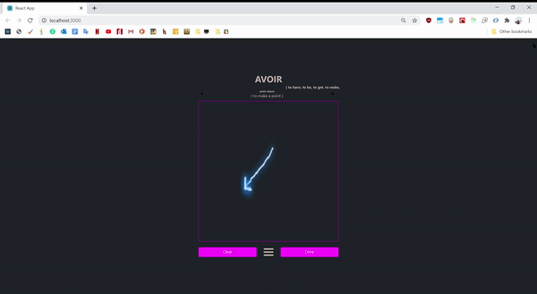
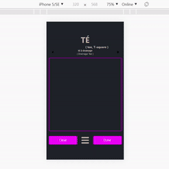

# Word Scenes
Want to expand your vocabulary? Drawing a scene is a tried a true way to enhance memory! It's derived from the Link Memory Method.

Let's say you want to build your French vocabulary and you are a native English speaker. The app will fetch two things: a random French word with English translation & a French sentence with that word and English translation. The point is to draw a scene related to that word or sentence then submit it. Every once in a while, the app will throw the illustration back to you asking what word was associated with it.

## Prerequisites
Before you begin, ensure you have the following:
* Internet connection

## Installing Word Scenes
To install Word Scenes, follow these steps:
Windows:

## Using Word Scenes
To use Word Scenes, follow these steps:

## Contributing to Word Scenes
To contribute to Word Scenes, follow these steps:
1. Fork this repository.
2. Create a branch: git checkout -b <branch_name>.
3. Make your changes and commit them: git commit -m '<commit_message>'
4. Push to the original branch: git push origin <project_name>/<location>
5. Create the pull request.
6. Alternatively see the GitHub documentation on creating a pull request.

## Phone Compatibility

## Change Language

## Scrolling Translations

## Draw for Better Memory

